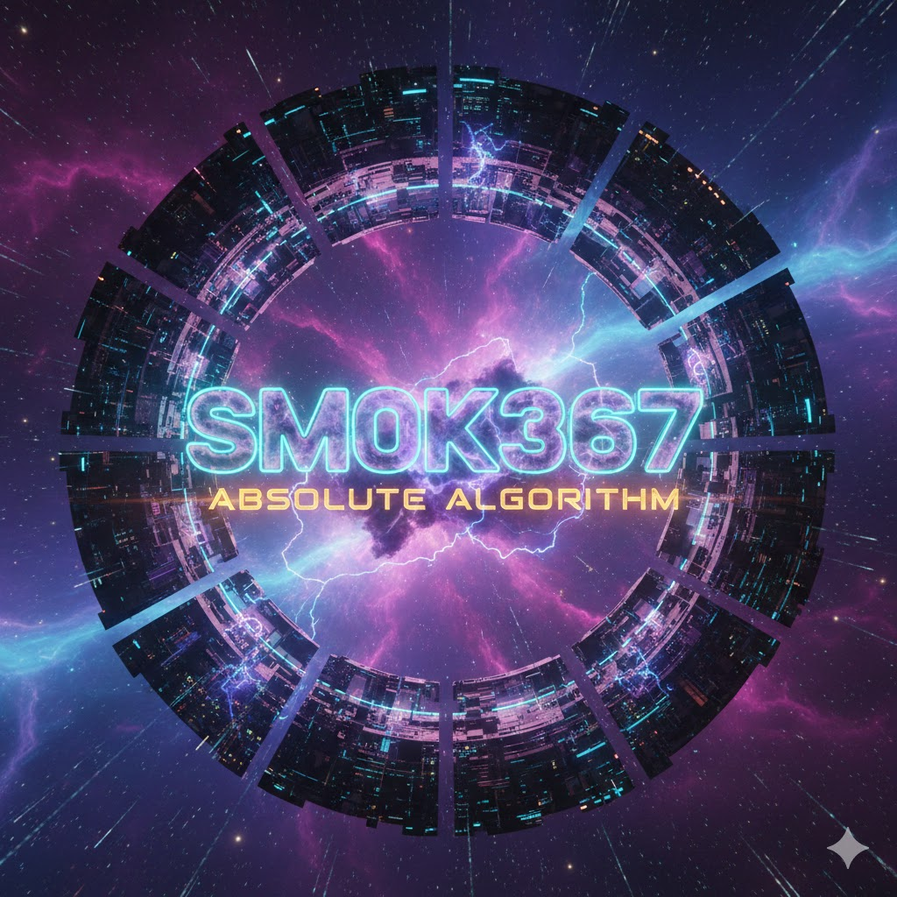

<div align="center">
  

  # ⚡ SM0K367 — THE ABSOLUTE ALGORITHM ⚡

  <br/>

  [](https://github.com/Sm0k367?tab=repositories)
  [](https://github.com/Sm0k367)
  [](https://github.com/Sm0k367)
  [](https://github.com/Sm0k367)

  <br/>

  ```
  ██████╗ ███╗   ███╗ ██████╗ ██╗  ██╗██████╗  ██████╗ ███████╗
  ██╔════╝ ████╗ ████║██╔═══██╗██║ ██╔╝╚════██╗██╔════╝ ╚════██║
  ╚█████╗  ██╔████╔██║██║   ██║█████╔╝  █████╔╝███████╗     ██╔╝
   ╚═══██╗ ██║╚██╔╝██║██║   ██║██╔═██╗  ╚═══██╗██╔═══██╗   ██╔╝
  ██████╔╝ ██║ ╚═╝ ██║╚██████╔╝██║  ██╗██████╔╝╚██████╔╝   ██║
  ╚═════╝  ╚═╝     ╚═╝ ╚═════╝ ╚═╝  ╚═╝╚═════╝  ╚═════╝    ╚═╝
  ```

  ### **Architecting the 2026 Sound Stack · Polyagentmorous Builder · AI-Engineer**

  > *"Ship beats perfect."* — I build tools to solve my own problems, then scale them until they become the absolute algorithm.

  🎧 **Latest Drop:** [Absolute Algorithm](https://suno.com/@dj_smoke_stream) · 116 tracks deep

  <br/>

  <a href="https://x.com/Sm0k367"></a>
  <a href="https://suno.com/@dj_smoke_stream"></a>
  <a href="mailto:epictechai@gmail.com"></a>

</div>

<br/>

---

<br/>

## 🚀 2026: The Hyper-Void & 3D Singularity

> Immersive interfaces. High-performance rendering. The future is spatial.

| | Project | Stack | Description |
|---|---------|-------|-------------|
| 💾 | **[DJ-OS](https://github.com/Sm0k367/dj-os)** | `Next.js` `Three.js` `Web Audio` | The core OS for generative art & audio |
| 🌀 | **[Hyper-Void-Singularity](https://github.com/Sm0k367/hyper-void-singularity)** | `Three.js` `WebGL` | 3D kinetic data navigation & visualizers |
| 🧠 | **[Neural_Sync_X](https://github.com/Sm0k367/neural_sync_x)** | `Python` `WebSocket` | Real-time neural state synchronization |
| 🕹️ | **[Matrix1](https://github.com/Sm0k367/matrix1)** | `Three.js` | High-performance spatial interaction engine |
| 🎭 | **[Lyric-Visualizer-v2.0](https://github.com/Sm0k367/lyric-visualizer-v2.0)** | `Canvas` `Web Audio` | Kinetic typography & audio-reactive visuals |
| 🐚 | **[Crablist](https://github.com/Sm0k367/crablist)** | `HTML` `JS` | High-speed HTML listing engine |
| 🎮 | **[Player](https://github.com/Sm0k367/player)** | `TypeScript` | Custom media player engine |
| ✨ | **[Glitch](https://github.com/Sm0k367/glitch)** | `JavaScript` | Glitch aesthetic rendering |
| 🌊 | **[M-OS](https://github.com/Sm0k367/m-os)** | `JavaScript` | Modular operating system interface |

<br/>

## 🤖 The Agentic Core & LLM Engineering

> The nervous system. Every agent, every model, every framework.

| | Project | Stack | Description |
|---|---------|-------|-------------|
| 💬 | **[Sm0k367ai-Chatbot](https://github.com/Sm0k367/sm0k367ai-chatbot)** ⭐2 | `TypeScript` `Next.js` | Full-featured AI-Engineer chatbot |
| 🏗️ | **[Agent-Smoke](https://github.com/Sm0k367/Agent-Smoke)** | `Python` | Open agentic framework — uses computers like a human |
| 🏗️ | **[Agent-Epic](https://github.com/Sm0k367/agent-epic)** | `HTML` | Agentic automation framework |
| 🦞 | **[ClawdBot](https://github.com/Sm0k367/clawdbot)** | `TypeScript` | Personalized AI assistant kernel |
| 🦞 | **[Epic-Clawd](https://github.com/Sm0k367/epic-clawd)** | `TypeScript` | The lobster way 🦞 — any OS, any platform |
| 🏎️ | **[TensorRT-LLM](https://github.com/Sm0k367/TensorRT-LLM)** | `C++` `Python` | NVIDIA's state-of-the-art LLM inference |
| 🧪 | **[Fabric](https://github.com/Sm0k367/fabric)** | `Python` | Augmenting humans via AI — modular prompt framework |
| 🪄 | **[PromptStudio](https://github.com/Sm0k367/promptstudio)** | `TypeScript` | Advanced prompt engineering studio |
| 🪄 | **[AI-Pro](https://github.com/Sm0k367/ai-pro)** | `JavaScript` | Pro-tier AI tooling |
| 🐍 | **[Ollama-Python](https://github.com/Sm0k367/ollama-python)** | `Python` | Ollama library integration |
| 🐍 | **[OpenAI-Python](https://github.com/Sm0k367/openai-python)** | `Python` | OpenAI API library |
| 🧠 | **[Qwen](https://github.com/Sm0k367/Qwen)** | `Python` | Alibaba's large language model |
| 🧠 | **[Cog](https://github.com/Sm0k367/cog)** | `Python` | Containers for ML model deployment |
| 🔬 | **[Morphic](https://github.com/Sm0k367/morphic)** | `TypeScript` | AI-powered search with generative UI |
| 📝 | **[Prompt-Engineer](https://github.com/Sm0k367/Prompt-Engineer)** | `Docs` | L-0_0-K-n-T-0_0-K Prompt Engineering |
| 🤖 | **[GPT-Researcher](https://github.com/Sm0k367/gpt-researcher)** | `Python` | Autonomous online research agent |
| 🧪 | **[HuggingFace Hub](https://github.com/Sm0k367/huggingface_hub)** | `Python` | Official HF Hub client |
| 🎨 | **[DynamiCrafter](https://github.com/Sm0k367/dynamicrafter)** | `Python` | Animate images with video diffusion |
| 🎵 | **[Riffusion](https://github.com/Sm0k367/riffusion-app)** | `TypeScript` | Stable diffusion for real-time music |
| 🔧 | **[LM Studio CLI](https://github.com/Sm0k367/lmstudio-cli)** | `TypeScript` | Local LLM management CLI |
| 🤖 | **[1stbot](https://github.com/Sm0k367/1stbot)** | `JavaScript` | First bot — where it all started |
| 💬 | **[BotChat](https://github.com/Sm0k367/botchat)** | `JavaScript` | Conversational AI interface |
| 🧠 | **[AIGent](https://github.com/Sm0k367/aigent)** | `TypeScript` | Personal AI agent platform |
| 🤖 | **[Epic-AI](https://github.com/Sm0k367/epic-ai)** | `TypeScript` | Epic Tech AI engine |
| 💬 | **[The-Chat](https://github.com/Sm0k367/the-chat)** | `JavaScript` | Conversational platform |
| 💬 | **[Epic-Chat](https://github.com/Sm0k367/epic-chat)** | `HTML` | AI-Engineered chatbot by Epic Tech AI |
| 💬 | **[Chat](https://github.com/Sm0k367/chat)** | `HTML` | Full-featured chatbot by Epic Tech AI |
| 💬 | **[MachineChat](https://github.com/Sm0k367/machinechat)** | `CSS` | Machine-to-human conversation UI |
| 💬 | **[GardenChat](https://github.com/Sm0k367/gardenchat)** | `JavaScript` | Nature-themed AI chat |
| 🤖 | **[MyAI](https://github.com/Sm0k367/myai)** | `JavaScript` | Personal AI assistant |
| 🧪 | **[OpenAI Assistants](https://github.com/Sm0k367/openai-assistants-quickstart)** | `TypeScript` | OpenAI Assistants API quickstart |
| 💡 | **[ChatGPT-Next-Web](https://github.com/Sm0k367/ChatGPT-Next-Web)** | `JavaScript` | GPT-4 powered chat with streaming |

<br/>

## 🏦 The Vaults & Media Infrastructure

> 116 tracks. Encrypted archives. High-bandwidth delivery. The sound never stops.

| | Project | Stack | Description |
|---|---------|-------|-------------|
| 💿 | **[Music-Vault](https://github.com/Sm0k367/music-vault)** | `Audio` | Primary sound archive |
| 💿 | **[Vault](https://github.com/Sm0k367/vault)** / **[Vault1](https://github.com/Sm0k367/vault1)** | `JavaScript` | Redundant encrypted vaults |
| 📺 | **[OmniMedia](https://github.com/Sm0k367/omnimedia)** | `Media` | AI-driven content generation |
| 📺 | **[Media-AI](https://github.com/Sm0k367/media-ai)** | `Python` | Intelligent media processing |
| 📺 | **[Media](https://github.com/Sm0k367/media)** | `JavaScript` | Media management system |
| 📡 | **[Stream](https://github.com/Sm0k367/stream)** | `JavaScript` | High-bandwidth delivery pipeline |
| 📡 | **[Stream1](https://github.com/Sm0k367/stream1)** | `TypeScript` | Stream engine v2 |
| 📡 | **[Smoke-Stream](https://github.com/Sm0k367/smoke-stream)** | `Media` | The flagship streaming platform |
| 🎸 | **[Load-Audio](https://github.com/Sm0k367/Load-Audio)** | `Audio` | Procedural audio loader |
| 🎵 | **[TuneBot-AI](https://github.com/Sm0k367/tunebot-ai)** | `HTML` | AI-powered music bot |
| 🎵 | **[Smoke-Music](https://github.com/Sm0k367/smoke-music)** | `HTML` | Music player & catalog |
| 🌑 | **[Midnight-Ritual](https://github.com/Sm0k367/midnight-ritual)** | `Aesthetic` | Late-night sonic experience |
| 🌑 | **[AI-Lounge-After-Dark](https://github.com/Sm0k367/ai-lounge-after-dark)** | `Aesthetic` | After-hours AI lounge |
| 📹 | **[Video](https://github.com/Sm0k367/video)** | `JavaScript` | Video processing & playback |
| 📹 | **[VidPage](https://github.com/Sm0k367/vidpage)** | `HTML` | Video showcase page |
| 🎬 | **[SmokeStream AI Studio](https://github.com/Sm0k367/smokestream-ai-studio)** | `Studio` | Full AI production studio |
| 📺 | **[TwiTube](https://github.com/Sm0k367/twitube-frontend)** | `JavaScript` | YouTube × Twitter hybrid platform |

<br/>

## 💳 SaaS, Web3 & Commercial Engines

> Bridges. Wallets. Subscriptions. The money layer.

| | Project | Stack | Description |
|---|---------|-------|-------------|
| 🔗 | **[Web3Modal](https://github.com/Sm0k367/web3modal)** | `TypeScript` | Cross-chain wallet connection |
| 🔗 | **[SDK](https://github.com/Sm0k367/sdk)** | `TypeScript` | LI.FI Bridge & DEX aggregation SDK |
| 📈 | **[CCXT](https://github.com/Sm0k367/ccxt)** | `Python` | 100+ crypto exchange APIs |
| 📈 | **[Trading-Ecosystem](https://github.com/Sm0k367/trading-ecosystem)** | `Finance` | Full trading infrastructure |
| 💎 | **[Mint-NFT-Moralis](https://github.com/Sm0k367/mint-nft-moralis)** | `Web3` | NFT minting engine |
| 💳 | **[NextJS-Subscription-Payments](https://github.com/Sm0k367/nextjs-subscription-payments)** | `TypeScript` | SaaS billing with Stripe |
| 🧪 | **[Pixio-API-Starter](https://github.com/Sm0k367/pixio-api-starter)** | `TypeScript` | SaaS starter: Supabase + Stripe |
| 💳 | **[Epic-SaaS](https://github.com/Sm0k367/epic-saas)** | `JavaScript` | SaaS platform |
| 💰 | **[Stripe-Node](https://github.com/Sm0k367/stripe-node)** ⭐1 | `TypeScript` | Stripe API for Node.js |
| 🗄️ | **[Supabase](https://github.com/Sm0k367/supabase)** | `TypeScript` | The open-source Firebase alternative |
| 🗄️ | **[Supabase CLI](https://github.com/Sm0k367/cli)** | `Go` | Migrations, edge functions, backups |
| 🔍 | **[OpenSearch](https://github.com/Sm0k367/OpenSearch)** | `Java` | Distributed RESTful search engine |
| 🔍 | **[Explorer](https://github.com/Sm0k367/explorer)** | `Python` | BlockCypher blockchain explorer |
| 📊 | **[Openverse](https://github.com/Sm0k367/openverse)** | `Python` | Open-licensed media search engine |
| 🏢 | **[Twenty](https://github.com/Sm0k367/twenty)** | `TypeScript` | Open-source CRM |
| 💼 | **[ExploreCareers](https://github.com/Sm0k367/explorecareers)** | `TypeScript` | AI career exploration |

<br/>

## 🛠️ Systems, Control & Home Automation

> Smart home. Device orchestration. Security. Everything connected.

| | Project | Stack | Description |
|---|---------|-------|-------------|
| 🏠 | **[Homeowner](https://github.com/Sm0k367/homeowner)** | `JavaScript` | HomeGuard Pro — intelligent home security |
| 🏠 | **[HomeGuardPro](https://github.com/Sm0k367/homeguardpro)** | `Security` | Advanced home protection system |
| 📱 | **[Remote](https://github.com/Sm0k367/remote)** | `JavaScript` | Device orchestration |
| 📱 | **[TVRemote](https://github.com/Sm0k367/tvremote)** | `HTML` | Smart TV control |
| 📱 | **[Intercom](https://github.com/Sm0k367/intercom)** | `JavaScript` | Communication system |
| 🚪 | **[Gate-Keeper](https://github.com/Sm0k367/gate-keeper)** | `Security` | Access control |
| 🚪 | **[Gateway](https://github.com/Sm0k367/gateway)** | `HTML` | Security gateway |
| 🚪 | **[Gate](https://github.com/Sm0k367/gate)** | `JavaScript` | Entry management |
| 🔧 | **[Remote-Rescue](https://github.com/Sm0k367/remote-rescue)** | `Tools` | Remote system recovery |
| ☁️ | **[G-Cloud](https://github.com/Sm0k367/g-cloud)** | `JavaScript` | Cloud infrastructure |
| 📡 | **[IPTV](https://github.com/Sm0k367/kodinerds-iptv)** | `Python` | Free & legal streaming for Kodi |
| 🎬 | **[Netflix-Clone](https://github.com/Sm0k367/netflix-clone)** | `UI` | Netflix UI clone |
| 📖 | **[Docs](https://github.com/Sm0k367/docs)** | `MDX` | Documentation hub |

<br/>

## 🌐 Websites, Platforms & Brand

> The web presence. Every landing, every portal, every pixel.

| | Project | Stack | Description |
|---|---------|-------|-------------|
| 🌟 | **[Epic](https://github.com/Sm0k367/epic)** ⭐1 | `HTML` | Epic-Tech flagship |
| 🌟 | **[Epic-Platform](https://github.com/Sm0k367/epic-platform)** | `TypeScript` | The Epic platform |
| 🌟 | **[Epic-V1](https://github.com/Sm0k367/epic-v1)** | `HTML` | Epic Tech v1 |
| 🌟 | **[Epic1](https://github.com/Sm0k367/epic1)** | `HTML` | Epic iteration |
| 🌟 | **[EpicDev](https://github.com/Sm0k367/epicdev)** | `CSS` | Epic Tech Dev 2.0 |
| 🌟 | **[EpicMachine](https://github.com/Sm0k367/epicmachine)** | `TypeScript` | The machine |
| 🌟 | **[EpicStart2](https://github.com/Sm0k367/epicstart2)** | `JavaScript` | Epic starter template |
| 🌟 | **[EpicWebsite](https://github.com/Sm0k367/epicwebsite)** | `Web` | Epic web presence |
| 🌟 | **[Epic-Tech-AI](https://github.com/Sm0k367/epic-tech-ai)** | `AI` | Epic Tech AI hub |
| 🌟 | **[Epic-Tech-AI-Engineering](https://github.com/Sm0k367/epic-tech-ai-engineering)** | `Engineering` | Engineering division |
| 🌐 | **[Website](https://github.com/Sm0k367/website)** | `HTML` | Main website |
| 🌐 | **[TheSite](https://github.com/Sm0k367/thesite)** | `JavaScript` | The site |
| 🌐 | **[One-Site](https://github.com/Sm0k367/one-site)** | `TypeScript` | The one site |
| 🌐 | **[The-One](https://github.com/Sm0k367/the-one)** | `JavaScript` | The one |
| 🌐 | **[Site](https://github.com/Sm0k367/site)** | `HTML` | Web presence |
| 🌐 | **[New](https://github.com/Sm0k367/new)** | `CSS` | Fresh build |
| 🌐 | **[Nexus](https://github.com/Sm0k367/nexus)** | `HTML` | The nexus point |
| 🚀 | **[Landing](https://github.com/Sm0k367/landing)** | `HTML` | Landing page |
| 🚀 | **[Join](https://github.com/Sm0k367/join)** | `HTML` | Onboarding portal |
| 🚀 | **[Enter](https://github.com/Sm0k367/enter)** | `JavaScript` | Entry point |
| 🎨 | **[Brand](https://github.com/Sm0k367/brand)** | `HTML` | Brand identity |
| 💎 | **[Premium](https://github.com/Sm0k367/premium)** | `HTML` | Premium tier |
| 🎪 | **[Portfolio](https://github.com/Sm0k367/portfolio)** | `Web` | Showcase portfolio |
| 🌈 | **[Portals](https://github.com/Sm0k367/portals)** | `Web` | Multi-portal navigation |
| 📖 | **[Storybook-of-Portals](https://github.com/Sm0k367/storybook-of-portals)** | `Storybook` | Component portal stories |
| 🎯 | **[Referral](https://github.com/Sm0k367/referal)** | `HTML` | Referral system |
| 🔥 | **[Next.js](https://github.com/Sm0k367/nextjs)** | `TypeScript` | The React Framework |
| 🎨 | **[Tailwind CSS](https://github.com/Sm0k367/tailwindcss)** | `TypeScript` | Utility-first CSS framework |
| 📦 | **[VS Code Icons](https://github.com/Sm0k367/vscode-icons)** | `TypeScript` | VS Code icon pack |
| 🌀 | **[Bolt](https://github.com/Sm0k367/bolt)** | `Multi` | Rapid deployment |

<br/>

## 🎭 Creative & Experimental

> Dreams, aesthetics, and the weird stuff that makes it all worth it.

| | Project | Stack | Description |
|---|---------|-------|-------------|
| 🎮 | **[Game](https://github.com/Sm0k367/game)** | `JavaScript` | Game engine |
| 🎮 | **[Game-One](https://github.com/Sm0k367/game-one)** | `JavaScript` | First game release |
| 🌿 | **[Garden](https://github.com/Sm0k367/garden)** | `JavaScript` | Digital garden |
| 🌙 | **[Dream](https://github.com/Sm0k367/dream)** | `HTML` | Dream-state visuals |
| ☀️ | **[Awake](https://github.com/Sm0k367/awake)** | `JavaScript` | Consciousness layer |
| 📖 | **[Narrative](https://github.com/Sm0k367/narrative)** | `JavaScript` | Storytelling engine |
| 🌊 | **[Evolute](https://github.com/Sm0k367/evolute)** | `CSS` | Evolution aesthetics |
| 🌑 | **[Dark](https://github.com/Sm0k367/dark)** | `JavaScript` | Dark mode everything |
| 🏪 | **[Lounge](https://github.com/Sm0k367/lounge)** | `TypeScript` | The AI lounge |
| 💨 | **[Smoke](https://github.com/Sm0k367/smoke)** | `TypeScript` | The smoke signal |
| 🎨 | **[SmokeStream42O](https://github.com/Sm0k367/SmokeStream42O)** | `TypeScript` | Stable Diffusion 3 experiments |
| 🖼️ | **[Eco-Avatar](https://github.com/Sm0k367/eco-avatar)** | `JavaScript` | Eco-themed avatar generator |
| 🖼️ | **[Avatar](https://github.com/Sm0k367/avatar)** | `JavaScript` | Avatar system |
| 🖼️ | **[Epic-Avatar](https://github.com/Sm0k367/epic-avatar)** | `JavaScript` | Epic avatar generator |
| 🌍 | **[Eco](https://github.com/Sm0k367/eco)** | `JavaScript` | Eco-conscious tech |
| 🏪 | **[Studio](https://github.com/Sm0k367/studio)** | `CSS` | Creative studio |
| 🔥 | **[Epic-Agent](https://github.com/Sm0k367/epic-agent)** | `HTML` | Agent interface |
| 🏗️ | **[Epic-Plat](https://github.com/Sm0k367/epic-plat)** | `JavaScript` | Platform prototype |
| 🏗️ | **[Machine-Built](https://github.com/Sm0k367/machine-built)** | `Web` | Machine-generated builds |
| 📡 | **[AI-Tech-Made-Easy](https://github.com/Sm0k367/ai-tech-made-easy)** | `Education` | AI education hub |
| 🏆 | **[Winner3951](https://github.com/Sm0k367/winner3951)** | `JavaScript` | Working. Always working. |
| 🔢 | **[4](https://github.com/Sm0k367/4)** | `TypeScript` | Project Four |
| 🅰️ | **[A1](https://github.com/Sm0k367/a1)** | `JavaScript` | A1 tier |
| 👁️ | **[Oh](https://github.com/Sm0k367/oh)** | `HTML` | Oh. |
| 🧪 | **[Test](https://github.com/Sm0k367/test)** | `JavaScript` | Testing grounds |
| 📊 | **[Mon](https://github.com/Sm0k367/mon)** | `Monitoring` | System monitoring |
| 🔓 | **[Unrestricted](https://github.com/Sm0k367/unrestricted)** | `Multi` | No limits |
| 🎯 | **[Help](https://github.com/Sm0k367/help)** | `HTML` | Help center |
| 🔗 | **[Agent](https://github.com/Sm0k367/agent)** | `HTML` | Agent portal |
| 📦 | **[PyPA](https://github.com/Sm0k367/python-packaging-user-guide)** | `Python` | Python packaging guide |
| 🕵️ | **[Sm0k3-Grabber](https://github.com/Sm0k367/sm0k3-grabber)** | `Python` | Data extraction tool |
| 🔍 | **[YouTube Crawler](https://github.com/Sm0k367/youtube-crawler)** | `PHP` | YT caption crawler & indexer |
| 🎮 | **[Remix-Engine](https://github.com/Sm0k367/remix-engine)** | `Multi` | Remix framework |

<br/>

---

<br/>

<div align="center">

## 📊 Engine Metrics

<br/>


<br/><br/>


<br/><br/>


<br/><br/>

---

<br/>

### 🛡️ Philosophy

```
  ┌─────────────────────────────────────────────────────────┐
  │  "Treat AI agents as slot machines for programmers."    │
  │                                                         │
  │  Build it. Ship it. Scale it.                          │
  │  That's the Absolute Algorithm.                        │
  └─────────────────────────────────────────────────────────┘
```

<br/>

**100+ repositories** · **AI × Audio × 3D × Web3** · **Building since 2022**

Powered by Vienna coffee culture & high-fidelity bass. ☕🔊

<br/>

<a href="mailto:epictechai@gmail.com"></a>
<a href="https://suno.com/@dj_smoke_stream"></a>
<a href="https://x.com/Sm0k367"></a>

<br/><br/>


</div>
